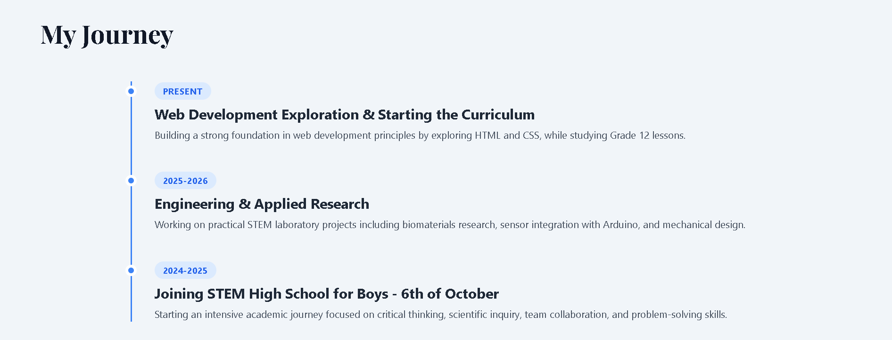

# My Personal Portfolio Website:
Welcome to my personal portfolio repository! I'm Salem Safwat, a Grade 12 student at STEM High School for Boys - 6th of October.

##Key Features:
- **Responsive Design:** Fully compatible with mobile, tablet, and desktop screens using Tailwind CSS.
- **Project Showcase:** Highlights my STEM Capstone projects with tags and links to posters.
- **My Journey Timeline:** Presents my academic and technical evolution from 2024 to present.
- **Social Links:** Direct access to my Facebook, Gmail, and WhatsApp.

##Tech Stack:
- **HTML:** Semantic structure and content layout.
- **Tailwind CSS (via CDN):** Modern, utility-first styling and dynamic layouts.
- **Google Fonts:** Playfair Display for elegant typography.

##Website Preview:

